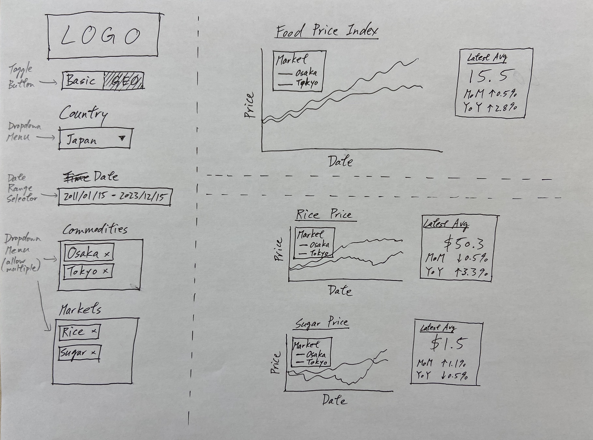
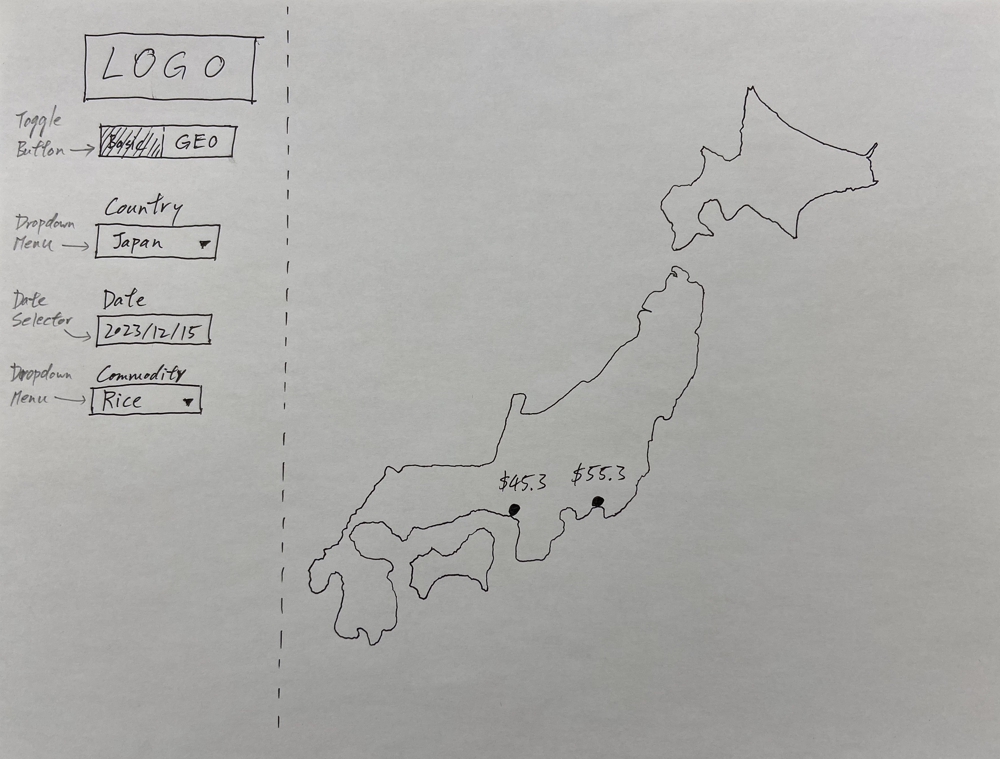

# Milestone 1 Proposal: Food Price Tracker 
Course project for DSCI 532 - Data Visualization II as a part of the UBC Master of Data Science program. 

Celeste Zhao, John Shiu, Simon Frew, Tony Shum

## 1. Motivation and Purpose
We are a team of data scientists from a food-focused NGO based in Canada. 
Our mission is to provide accessible solutions for understanding and addressing global food price trends. 
Our newly developed tool, Food Price Tracker, is tailored for non-technical policymakers and economists, NGO analysts, food suppliers, and the public with comprehensive insights into these trends.

### Problem Statement
Access to reliable food pricing information is crucial for informed decision-making in public policymaking and business strategy.  
However, we observed a lack of open, easy-to-use online platforms providing comprehensive global trends of food price with regional details.
Key challenges identified include 1) scattered and unorganized regional data requiring technical expertise to navigate, and 2) existing platforms being unintuitive for non-technical stakeholders for effective daily use.

To address this, we propose developing an interactive platform for global food price trends with regional resolution. 
Our platform aims to empower stakeholders with insights for informed decision-making on food prices worldwide. 
Key features and use cases include:

1. Historic food price trends, allowing policymakers to monitor and implement targeted preventive measures if needed.
2. Breakdowns by food category, providing specificity required for businesses to enhance resource planning. 
3. Accessible food price index for the general public, facilitating financial management of cost-of-living fluctuations.

Our platform is to enhance collaboration across sectors to address food-related challenges on a global scale.

## 2. Description of the Data
The proposed dataset for our project is the Global Food Prices dataset, openly available via [The Humanitarian Data Exchange (HDX)](https://data.humdata.org/dataset/global-wfp-food-prices). 
This dataset originates from the World Food Programme Price Database and includes pricing for items such as maize, rice, beans, fish, and sugar.
This data spans 98 countries and approximately 3,000 markets, beginning as early as 1992 for certain countries. 
Data is reported in monthly intervals and organized by country due to its extensive volume.

Our initial visualization will concentrate on the Japanese market and encompass data from 2011 to 2020. 
Following a proof-of-concept review, we will extend our framework to additional countries. 
The Japanese dataset contains approximately 1,180 records, each with 14 variables:

| Variable  | Category              | Type        | Description |
|-----------|-----------------------|-------------|-------------|
| date      | Record date           | Date        | Record date, typically the 15th of each month. |
| market    | Market information    | Categorical | Market name. |
| admin1    | Market information    | Categorical | Market province. |
| admin2    | Market information    | Categorical | Market city. |
| latitude  | Market information    | Float       | Market latitude. |
| longitude | Market information    | Float       | Market longitude. |
| category  | Food item information | Categorical | Food item category. |
| commodity | Food item information | Categorical | Specific name of food item. |
| unit      | Food item information | Categorical | The unit measurement of the food item (e.g., 5kg). |
| pricetype | Food price details    | Categorical | Price type, either retail or wholesale. |
| priceflag | Food price details    | Categorical | Price nature, typically "actual". |
| currency  | Food price details    | Categorical | Price local currency. |
| price     | Food price details    | Float       | Food item price in local currency. |
| usdprice  | Food price details    | Float       | Food item price in in USD, converted at current exchange rates. |

In addition to existing variables, we will derive new metrics to enhance our analysis. 
These will include price growth rates on a monthly and yearly basis, as well as a food price index that summarizes the prices of a selected basket of food items.

Utilizing the Global Food Prices dataset in our visualization tool will address the challenge of accessing geospatial food-related information, driving more effective decision-making in public policy, business strategies, and personal financial planning.

## 3. Research Questions and Usage Scenarios
Research questions and user stories are provided by sector below.

### Public Sector
Ms. Tiffany is an executive with the Ministry of Health, Labour and Welfare in Japan. 
Her role involves policy-making related to food supply, demand, and price dynamics. 
Her primary goal is to ensure that food prices across regions and major categories remain at acceptable levels to safeguard public well-being. 

#### User Story
- Ms. Tiffany navigates to the dashboard, which displays food price indices and food categories.
- She notices the price of rice nearing a threshold of concern and investigates.
- Ms. Tiffany focuses on rice and examines the 2-year trend. 
- She views the geospatial chart and to examine regional differences and sees that the Kansai region is higher than the national average.
- Ms. Tiffany proposes policy measures to combat this trend.
- She safeguards public well-being in the affected region through the use of our platform.

### Private Sector
Mr. Joel operates a business specializing in the supply and trade of cereals and tubers. 
He needs to analyze market trends and price data for these commodities to identify opportunities for profit.

#### User Story
- Mr. Joel logs into the dashboard and views key commodities: wheat, potatoes, and rice.
- He examines recent price trends to identify profitable commodities. 
- Mr. Joel increases the timeframe to visualize seasonal patterns, and sees the price of potatoes will increase in the coming months. He adjusts his strategy accordingly.
- Exploring the geospatial charts, he sees that demand is focused in a specific region. 
- Mr. Joel reallocates stock to capitalize on the high demand. 
- He improves financial returns and meets market demand via our platform. 

## 4. App sketch and brief description

The app's default landing page is a Basic view page, which displays time-series data on food prices, including indices, individual food prices, and their latest averages with monthly and yearly percentage changes for various markets in a chosen country. 
A sidebar allows users to customize the data by country, date range, and multiple commodities or markets. 
A toggle switch transitions to the Geo view.

In the Geo view, users see a country map with the latest prices of various markets of a specific commodity on a given date, facilitating regional price comparisons. 
The sidebar offers options to adjust data by country, commodity, and date.

